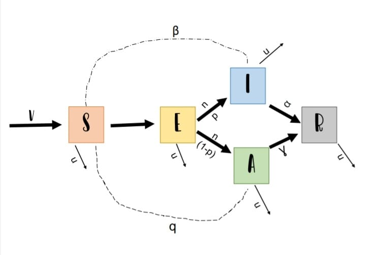
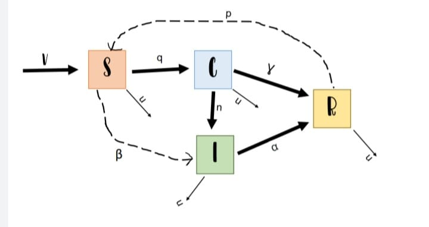
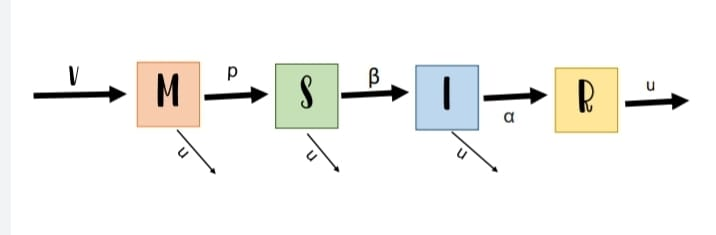
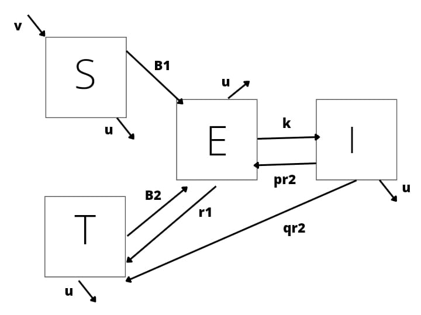

```{r setup, include=FALSE}
knitr::opts_chunk$set(echo = TRUE)
```

# Selección

Considera dos poblaciones $x(t)$ y $y(t)$ 

1. Si las pobalciones no interactuan las ecuaciones que gobierna al sistema son:
$$\dot x(t)=ax$$
$$\dot y(t)=by$$

con $a,b >0$ 
Demuestra que la soluciones son 

$$ x(t)=x_0e^{at}$$

$$y(t)=y_0e^{bt}$$
con $x_0$ y $y_0$ las poblaciones iniciales.

2. Construye la siguiente varibale $\rho(t)$

$$\rho(t)= \frac{x(t)}{y(t)}$$
Demuestra que esa la derivada de esa ecuación se puede poner como:

$$\dot \rho= (a-b)\rho$$
Sugerencia: utiliza la regla de la derivada de un cociente.

3. Demuestra que la solcuión de la  ecuación  anterior es:

$$\rho(t) =\rho_0e^{(a-b)*t}$$

4. A partir de esta solución demuestra que:
 - Si $a>b$ entonces $\rho(t)$ tiende a infinito y por lo tanto la población x elimina a la población y.Es decir x se selecciona sobre y
 - Si $a<b$ entonces $\rho(t)$ tiende a cero y por lo tanto la población y elimina a la población x.Es decir y se selecciona sobre x.

# Estadio asintomático


Las siguientes ecuaciones describen un modelo por compartimentos de una enfermedad infecciosa  con un estadio asintomático.
$$\dot S = \nu -\beta S(I +qA)-\mu S$$
$$\dot E= \beta S(I+qA) -(\eta+\mu)E $$
$$\dot I = p\eta E -(\alpha +\mu)I$$
$$\dot A= (1-p)\eta E -(\gamma +\mu)A$$
$$\dot R=\alpha I +\gamma A-\mu R$$

1. Dibuja el esquema por compartimentos que representa este conjunto de ecuaciones


2. Explica el significado de cada ecuaciónn: es decir, explica el significado de cada termino y cada parametro. ¿Existen parámetros que están acotados, si es así indica el intervalo en donde pueden variar?
 S= suceptibles
 E= expuestos
 I= infectados con sintomas
 A= infectados asintomaticos
 R= recuperado
 mu= muerte natural
 v= nacimientos
 beta=  tasa de infección de los sintomaticos
 q= tasa de infección de los asintomaticos 
 gama= tasa de recuperación de los infectados asintomaticos
 alfa= tasa de recuperación de infectados con sintomas
 n= la carga que determina si eres asintomatico o no lo eres
 p= proporcion de infectados con sintomas 
 1-p= proporcion deinfectados asintomaticos
Comenzamos con la derivada de S, donde v es nuestras tasa de nasimiento, la interacción de los susceptibles con los infectados está dado por una tasa beta, así como la de los susceptibles con los asintomáticos que esta dado por una tasa q, por lo que es negativas estas interacciones para los susceptibles porque este grupo comienza a perder gente, y también menos la tasa de muerte natural. Para la derivada de E tenemos las mismas interacciones de infectados y asintomáticos con susceptibles, lo cual beneficia a los expuestos, y también tenemos en negativo aquellos expuestos que pasan a infectados dado por una tasa n y menos mu que es la tasa de muerte natural. Para la derivada de I tenemos en positivo todos aquellos que pasan de expuestos a infectados o asintomáticos, esto es dado por n y en negativo aquellos infectados que pasan a recuperados a una tasa alfa y menos la tasa de muerte natural. En la derivada de A tenemos 1-p que reprenta aquella parte de los expuestos que se fue a asintomáticos por eso el positivo y luego tenemos menos gamma que son aquellos que pasaron a recuperados y menos la tasa se muerte natural. En nuestra derivada R tenemos nuestras distintas tasas de recuperación la alfa y gamma, menos la tasa de muerte natural.
Sí, n está acotado porque estamos diciendo que va de 0 a 1 
3. Bajo qué condiciones la población se conservaría?
Solo se conservaria cuando la tasa de nacimiento sea igual a la de las muertes, es decir "v = mu"
4. Encuentra, si existe, el punto de equilibrio *free-disease* 
Cuando la tasa de recuperación es mayor a la de infección, es decir 
```{r}
#tenemos que tener descargadas lass librerias 
library(deSolve)
library(ggplot2)
library(gridExtra)
#para sacar los puntos de equilibrio vamos a primero reescribir las ecuaciones 
SEIAR<- function(Time, State, Pars) { 
  with(as.list(c(State, Pars)), {
dS<- nu - beta *S*(I + q*A)- mu * S
dE<-beta*S*(I +q*A)-(n+mu)*E
dI<-p*n*E - (alfa+mu)*I
dA<-(1-p)*n*E - (gamma+mu)*A
dR<- alfa*I + gamma*A-mu*R
return(list(c(dS, dE,dI, dA, dR)))
  })
}
#esto es para definir cuanto valen parametros, en que condiciones iniciara, y el tiempo que durara y para finalmente correrlo
pars <- c(beta= 3, alfa= 5, gamma = 4.5, mu= 3/200, nu= .1, q= .4, n=3, p=4)
condiciones_iniciales <- c(S =11995,E=333, I=100,A= 130, R=70)
tiempo <- seq(0, 20, by = 0.001)
out <-ode(condiciones_iniciales, tiempo, SEIAR, pars)
#esto no se uede observar almenos que se grafique 
matplot(out[ , 1], out[ , 2:4], type = "l", xlab = "tiempo", ylab = "Población",
        main = "SEIAR", lwd = 2)
legend("topright", c("Susceptible","Expuesto", "Infectado","Asintomatico","Recuperado"), col = 1:3,lty=1:3,cex=0.5)#esto es para saber que es cada uno 
```
5.¿Qué tipo de enfermedad puede estar describiendo? Justifica tu respuesta. 
Creo que podría estar describiendo COVID dado que habia infectados asintomaticos y sintomaticos, lo unico que para mi le faltaria al modelo sería que hubiera un compartimentos de muerte por la enfermedad es decir, mu+potencial de muerte por covid
6. Selecciona un conjunto de para¡metros adecuados y resuelve numericamente el sistema de ecuaciones diferenciales. Asegurate que tu solución alcance un punto de equilibrio. Discute tu resultado.
```{r}
#tenemos que tener descargadas lass librerias 
library(deSolve)
library(ggplot2)
library(gridExtra)
#para sacar los puntos de equilibrio vamos a primero reescribir las ecuaciones 
SEIAR<- function(Time, State, Pars) { 
  with(as.list(c(State, Pars)), {
dS<- nu - beta *S*(I + q*A)- mu * S
dE<-beta*S*(I +q*A)-(n+mu)*E
dI<-p*n*E - (alfa+mu)*I
dA<-(1-p)*n*E - (gamma+mu)*A
dR<- alfa*I + gamma*A-mu*R
return(list(c(dS, dE,dI, dA, dR)))
  })
}
#esto es para definir cuanto valen parametros, en que condiciones iniciara, y el tiempo que durara y para finalmente correrlo
pars <- c(beta= 3, alfa= 5, gamma = 4.5, mu= 3/200, nu= .1, q= .4, n=3, p=4)
condiciones_iniciales <- c(S =11995,E=333, I=100,A= 130, R=70)
tiempo <- seq(0, 20, by = 0.001)
out <-ode(condiciones_iniciales, tiempo, SEIAR, pars)
#esto no se uede observar almenos que se grafique 
matplot(out[ , 1], out[ , 2:4], type = "l", xlab = "tiempo", ylab = "Población",
        main = "SEIAR", lwd = 2)
legend("topright", c("Susceptible","Expuesto", "Infectado","Asintomatico","Recuperado"), col = 1:3,lty=1:3,cex=0.5)#esto es para saber que es cada uno
```
Como podemos ver, con los parametros que pusimos a todos los lleva a recuperarse 

# Estadio crónico 

Las siguientes ecuaciones describen un modelo por compartimentos de una enfermedad infecciosa  con un estadio crónico.
$$\dot S = \nu -\beta S(I +qC)-\mu S +\rho R$$
$$\dot C= \beta S(I+qC) -(\eta+\gamma +\mu)C $$
$$\dot I = \eta C -(\alpha +\mu)I$$
$$\dot R= \alpha I +\gamma C -(\mu +\rho)R$$


1. Dibuja el esquema por compartimentos que representa este conjunto de ecuaciones


2. Explica el significado de cada ecuación: es decir, explica el significado de cada termino y cada parámetro. ¿Existen parámetros que están acotados, si  es así indica el intervalo en donde pueden variar?
En este caso no hay niguno acotado
S = susceptibles
I = infectados
C = crónicos
R = recuperados
beta = tasa de infección
v = tasa de nacimientos 
mu = tasa de muerte natural 
alfa = tasa de recuperación de infectados
gamma = tasa se recuperación de los infectados
p = tasa que pasan de recuperados a susceptibles
q = tasa de infección de los susceptibles con los crónicos
n = tasa de crónicos a infectados
Comenzamos con la derivada de , en la cual tenemos v que nuestra tasa de nacimientos, y la interacción -beta SI la cual es la interaccion de los intectados con suceptibles dada por un tasa beta y y aquellos suceptibles que pasan a cronicos dados por una tasa q, asi como la tasa de muerte natural mu de suceotibles y aumenta la tasa de recuperados p. En la derivada C´tenemos la interaccion positiva de suceotibles con infectados dado una tasabeta, aligual que la q, menos nuestra tasa que pasan a infectados, tasa de muerte natural y recuperados. En nuestra derivasa I tenemos aquellos cronicos que se infectan y restando tenemos aquellos que pierden los infectados, ya sea por muerte natural o porque se recuperan. Por ultimo en la derivada de R tenemos los infectados y cronicos que se recuoeran y se pierden recperados que pasan a suceptibles y aquellos que mueren por causas naturales
3. ¿Bajo qué condiciones la población se conservaría?
Solo se conservaria cuando la tasa de nacimiento sea igual a la de las muertes, es decir "v = mu"
4. Encuentra, si existe, el punto de equilibrio *free-disease*  
```{r}
#tenemos que tener descargadas lass librerias 
library(deSolve)
library(ggplot2)
library(gridExtra)
#para sacar los puntos de equilibrio vamos a primero reescribir las ecuaciones 
SCIR<- function(Time, State, Pars) { 
  with(as.list(c(State, Pars)), {
dS<- nu -beta* S*(I +q*C)-mu *S + rho *R
dC<-beta *S*(I+q*C) -(eta+gamma +mu)*C 
dI<- eta *C -(alfa +mu)*I
dR<-alfa *I +gamma* C -(mu +rho)*R 
return(list(c(dS, dC,dI,dR)))
  })
}
#esto es para definir cuanto valen parametros, en que condiciones iniciara, y el tiempo que durara y para finalmente correrlo
pars <- c(beta= 2, alfa= 5, gamma = 4, mu= 3/200, nu= .1, eta=.3, rho= .9, q=9)  
condiciones_iniciales <- c(S =11995,C=300, I=800, R=80)
tiempo <- seq(0, 20, by = 0.001)
out <-ode(condiciones_iniciales, tiempo, SCIR, pars)
#esto no se uede observar almenos que se grafique 
matplot(out[ , 1], out[ , 2:4], type = "l", xlab = "tiempo", ylab = "Población",
        main = "SCIR", lwd = 2)
legend("topright", c("Susceptible","Cronico", "Infectado","Recuperado"), col = 1:3,lty=1:3,cex=0.5)#esto es para saber que es cada uno 
```

5. ¿Qué tipo de enfermedad puede estar describiendo? Justifica tu respuesta.
Creo que esta enfermedad podría ser representada por el Herpes, dado que puedes tener se podria decir que una reinfección, te puedes recuperar pero no del todo, y de un estado cronico puedes pasar de nuevo a infectarte con el mismo
6. Selecciona un conjunto de parámetros adecuados y resuelve numéricamente el sistema de ecuaciones diferenciales. Asegurate que tu solución alcance un punto de equilibrio.Discute tu resultado. 
```{r}
#tenemos que tener descargadas lass librerias 
library(deSolve)
library(ggplot2)
library(gridExtra)
#para sacar los puntos de equilibrio vamos a primero reescribir las ecuaciones 
SCIR<- function(Time, State, Pars) { 
  with(as.list(c(State, Pars)), {
dS<- nu -beta* S*(I +q*C)-mu *S + rho *R
dC<-beta *S*(I+q*C) -(eta+gamma +mu)*C 
dI<- eta *C -(alfa +mu)*I
dR<-alfa *I +gamma* C -(mu +rho)*R 
return(list(c(dS, dC,dI,dR)))
  })
}
#esto es para definir cuanto valen parametros, en que condiciones iniciara, y el tiempo que durara y para finalmente correrlo
pars <- c(beta= 2, alfa= 5, gamma = 4, mu= 3/200, nu= .1, eta=.3, rho= .9, q=9)  
condiciones_iniciales <- c(S =11995,C=300, I=800, R=80)
tiempo <- seq(0, 20, by = 0.001)
out <-ode(condiciones_iniciales, tiempo, SCIR, pars)
#esto no se uede observar almenos que se grafique 
matplot(out[ , 1], out[ , 2:4], type = "l", xlab = "tiempo", ylab = "Población",
        main = "SCIR", lwd = 2)
legend("topright", c("Susceptible","Cronico", "Infectado","Recuperado"), col = 1:3,lty=1:3,cex=0.5)#esto es para saber que es cada uno 
```
Aquí con los parametros que pusimo podemos ver como los cronicos se van a mantener, mientras que los demas van a tender a ir hacia abajo

# Estadio de inmunidad pasiva

La inmunidad pasiva consiste en la transferencia de inmunidad activa en la forma de anticuerpos de un individuo  a otro.La inmunidad pasiva puede suceder de forma natural, por ejemplo, por la vía materna al feto a través de la placenta o al bebé vía la leche materna. El estadio de inmunidad pasiva se denota por la variable $M(t)$ y se añade al sistema antes de que los individuops sean suceptibles. El siguiente modelo **MSIR** se describe con las siguientes ecuaciones diferenciales.


$$\dot M = \nu -\rho M- \mu M$$
$$\dot S= \rho M -\beta SI-\mu S $$
$$\dot I = \beta SI -(\alpha +\mu)I$$
$$\dot R= \alpha I -\mu R$$


1. ¿Bajo qué condiciones se puede inducir de forma artificial la inmunidad pasiva? Cuando se le inyecta el virus de forma que este inactiva , de esta manera de induce la inmunidad pasiva 
2. Dibuja el esquema por compartimentos que representa este conjunto de ecuaciones

3. Explica el significado de cada ecuación: es decir, explica el significado de cada término y cada parámetro. ¿Existen parámetros que están acotados, si es así, indica el intervalo en donde pueden variar?
M= inmunidad pasiva
S= suceptibles
I= infectados
R= recuperados
v= tasa de nacimientos 
beta= tasa de infección
rho= tasa de la perdida de inmunidad
mu= tasa de muerte natural 
alfa= tasa de recuperación
En nuestra derivada M podemos observar v que entran todos los nacimientos, depues viene p que esta tasa es de todos aquellos que perdieron la inmunidad, así como tambien tenemos salida de muerte natural. En nuestra derivaba S tenemos que beneficia a los suceptibles la tasa de los que perdieron la inmunidad y que perjudica con la interacción que tiene suceptibles e infectados a una tasa beta y a su vez la tasa de muerte natural. En la derivada de I tenemos que la interacion de suceptibles con infectados a una tasa beta benefiica a los infectados, pero por otro lado, tenemos la tasa de recuperación alfa y la salidad de muertes natural. Por ultimo en la derivada de R, tenemo que veneficia los infectados que se recuperan y perjudica la salida de muerte natural
4. ¿Bajo qué condiciones la población se conservaría?
Solo se conservaria cuando la tasa de nacimiento sea igual a la de las muertes, es decir "v = mu"
5. Encuentra, si existe, el punto de equilibrio *free-disease*
Cuando la tasa de recuperación es mayor a la de infección, es decir:
```{r}
#tenemos que tener descargadas lass librerias 
library(deSolve)
library(ggplot2)
library(gridExtra)
#para sacar los puntos de equilibrio vamos a primero reescribir las ecuaciones 
MSIR<- function(Time, State, Pars) { 
  with(as.list(c(State, Pars)), {
dM<-  nu -rho *M- mu *M
dS<- rho *M -beta* S*I-mu* S 
dI <- beta* S*I -(alfa + mu)*I
dR<- alfa* I -mu* R
return(list(c(dM, dS,dI,dR)))
  })
}
#esto es para definir cuanto valen parametros, en que condiciones iniciara, y el tiempo que durara y para finalmente correrlo
pars <- c(beta= 2, alfa= 5, mu= 3, nu= 1, rho= 9)  
condiciones_iniciales <- c(M=3000, S =11995, I=100, R=150)
tiempo <- seq(0, 20, by = 0.001)
out <-ode(condiciones_iniciales, tiempo, MSIR, pars)
#esto no se uede observar almenos que se grafique 
matplot(out[ , 1], out[ , 2:4], type = "l", xlab = "tiempo", ylab = "Población",
        main = "MSIR", lwd = 2)
legend("topright", c("Inmunidad pasiva","Suceptible", "Infectado","Recuperado"), col = 1:3,lty=1:3,cex=0.5)#esto es para saber que es cada uno
```

6. ¿Qué tipo de enfermedad puede estar describiendo? Justifica tu respuesta. 
Puede ser cualquier tipo de virus que mediante una vacuna que se le implemento a la madre este lo haya adquirido por medio de la leche materna
7. Selecciona un conjunto de parámetros adecuados y resuelve numéricamente el sistema de ecuaciones diferenciales. Asegurate que tu solución alcance un punto de equilibrio.Discute tu resultado.
```{r}
#tenemos que tener descargadas lass librerias 
library(deSolve)
library(ggplot2)
library(gridExtra)
#para sacar los puntos de equilibrio vamos a primero reescribir las ecuaciones 
MSIR<- function(Time, State, Pars) { 
  with(as.list(c(State, Pars)), {
dM<-  nu -rho *M- mu *M
dS<- rho *M -beta* S*I-mu* S 
dI <- beta* S*I -(alfa + mu)*I
dR<- alfa* I -mu* R
return(list(c(dM, dS,dI,dR)))
  })
}
#esto es para definir cuanto valen parametros, en que condiciones iniciara, y el tiempo que durara y para finalmente correrlo
pars <- c(beta= 2, alfa= 5, mu= 3, nu= 1, rho= 9)  
condiciones_iniciales <- c(M=3000, S =11995, I=100, R=150)
tiempo <- seq(0, 20, by = 0.001)
out <-ode(condiciones_iniciales, tiempo, MSIR, pars)
#esto no se uede observar almenos que se grafique 
matplot(out[ , 1], out[ , 2:4], type = "l", xlab = "tiempo", ylab = "Población",
        main = "MSIR", lwd = 2)
legend("topright", c("Inmunidad pasiva","Suceptible", "Infectado","Recuperado"), col = 1:3,lty=1:3,cex=0.5)#esto es para saber que es cada uno
```
Podemos ver que bajo estas condiciones todos en algun momento tienden a ir a 0 y en muy poco tiempo

#  Tratamiento

Considera el sigueinte conjunto de ecuaciones diferenciales que describen una enfermedad infecciosa con individuos en tratamiento $T(t)$.

$$\dot S = \nu -\beta_1 \frac{SI}{N}- \mu S$$
$$\dot E= \beta_1\frac{SI}{N} + \beta_2 \frac{TI}{N}-(\mu +\kappa +r_1)E +pr_2I $$
$$\dot I = \kappa E-(r_2+\mu)I $$
$$\dot T = r_1E +qr_2I -\beta_2\frac{TI}{N}-\mu T$$

con $N(t)=S(t)+E(t)+I(t)+T(t)$

1. Dibuja el esquema por compartimentos que representa este conjunto de ecuaciones

2. Explica el significado de cada ecuación: es decir, explica el significado de cada terrmino y cada parámetro. 
¿Existen parámetros que están acotados, si es así indica el intervalo en donde pueden variar?
S = suceptibles
E = expuestos 
T = tratamiento
I = infectados
v = tasa de nacimientos 
u = tasa de muerte natural
b1= tasa de transmision entre suceptibles y expuestos
b2= tasa de transmision entre suceptibles e infectados
k= expuestos pasen a infectados 
r1= tasa de recuperacion por tratamiento de los expuestos
pr2= fraccion que pasa de infectados a expuestos 
qr2= fracción que de infectados a recibir un tratamiento 
En la derivada de S podemos ver que entra la tasa de nacimientos, para despues por una tasa de transmision entre infectados y suceptibles a una tasa beta estos pierden elementos, asi como tambien por causas de muerte natural. En la derivada de los expuestos tenemos que las dos tasa de interaccion ya sea por suceptibles con infectados o por aquellos que reciban tratamiento de los infectados sumaran para ser expuestos, al igual que una parte de los infectados pase de nuevo a expuestos, pero aqui perjudica la tasa de muerte natural, los expuestos que pasan a infectados y los recuperados por el tratamiento. En la derivada de I tenemos que se suman los expuestos y tenemos r2 que hace perder miembros ya sea por recibir traramiento y pasar a recuperarse o a expuestos y nuestra tasa de muerte natural. Por ultimo, tenemos el tratamiento el cual se ve beneficiado por la recuperacion a una tasa r1, al igual que los infectados que recibieron este, y se pierden aquellos que por tratamiento se infectan y la tasa de muerte natural 
3. ¿Bajo qué condiciones la población se conservaría?
Solo se conservaria cuando la tasa de nacimiento sea igual a la de las muertes, es decir "v = mu"
4. Encuentra, si existe, el punto de equilibrio *free-disease* 
Cuando la tasa de recuperación es mayor a la de infección, es decir:
```{r}
#tenemos que tener descargadas lass librerias 
library(deSolve)
library(ggplot2)
library(gridExtra)
#para sacar los puntos de equilibrio vamos a primero reescribir las ecuaciones 
SEIT<- function(Time, State, Pars) { 
  with(as.list(c(State, Pars)), {
dS<- nu -beta_1 *((S*I)/N)- mu *S
dE<- beta_1*((S*I)/N) + beta_2 *((T*I)/N)-(mu +kappa +r_1)*E +pr_2*I 
dI<-kappa *E-(r_2+mu)*I 
dT<- r_1*E +qr_2*I -beta_2*((T*I)/N)-mu *T
return(list(c(dS, dE,dI,dT)))
  })
}
#esto es para definir cuanto valen parametros, en que condiciones iniciara, y el tiempo que durara y para finalmente correrlo
pars <- c(beta_1= 7, beta_2=6 , mu= 0.05, nu= 0.01,kappa= 4, r_1=.5, pr_2= .8, qr_2=.7, r_2= .9, N = 100000)  
condiciones_iniciales <- c(S=3000, E =11995, I=100, T=150)
tiempo <- seq(1, 100, by = 0.001)
out <-ode(condiciones_iniciales, tiempo, SEIT, pars)
#esto no se uede observar almenos que se grafique 
matplot(out[ , 1], out[ , 2:5], type = "l", xlab = "tiempo", ylab = "Población",
        main = "SEIT", lwd = 2)
legend("topright", c("Suceptible","Expuesto", "Infectado","Tratamiento"), col = 1:3,lty=1:3,cex=0.5)#esto es para saber que es cada uno
```

5. ¿Qué tipo de enfermedad puede estar describiendo? Justifica tu respuesta.
Realmente no se me viene ninguno a la mente dado que me da entender que si recibes el tratamiento aun asi te puedes infectar, o que de infeccioso puedes pasar a expuesto y eso genera demasiada confusión 
6. Selecciona un conjunto de parámetros adecuados y resuelve numericamente el sistema de ecuaciones diferenciales. Asegurate que tu solución alcance un punto de equilibrio.Discute tu resultado.
```{r}
#tenemos que tener descargadas lass librerias 
library(deSolve)
library(ggplot2)
library(gridExtra)
#para sacar los puntos de equilibrio vamos a primero reescribir las ecuaciones 
SEIT<- function(Time, State, Pars) { 
  with(as.list(c(State, Pars)), {
dS<- nu -beta_1 *((S*I)/N)- mu *S
dE<- beta_1*((S*I)/N) + beta_2 *((T*I)/N)-(mu +kappa +r_1)*E +pr_2*I 
dI<-kappa *E-(r_2+mu)*I 
dT<- r_1*E +qr_2*I -beta_2*((T*I)/N)-mu *T
return(list(c(dS, dE,dI,dT)))
  })
}
#esto es para definir cuanto valen parametros, en que condiciones iniciara, y el tiempo que durara y para finalmente correrlo
pars <- c(beta_1= 7, beta_2=6 , mu= 0.05, nu= 0.01,kappa= 4, r_1=.5, pr_2= .8, qr_2=.7, r_2= .9, N = 100000)  
condiciones_iniciales <- c(S=3000, E =11995, I=100, T=150)
tiempo <- seq(1, 100, by = 0.001)
out <-ode(condiciones_iniciales, tiempo, SEIT, pars)
#esto no se uede observar almenos que se grafique 
matplot(out[ , 1], out[ , 2:5], type = "l", xlab = "tiempo", ylab = "Población",
        main = "SEIT", lwd = 2)
legend("topright", c("Suceptible","Expuesto", "Infectado","Tratamiento"), col = 1:3,lty=1:3,cex=0.5)#esto es para saber que es cada uno
```
Dados los valores que aqui pusimos me doy cuenta que al final todos estarán expuestos o infectados, en los casos más locos podria representar un apocalipsis zombi que al recibir el tratamiento se infecten jaja ay no :c 


# Modelo epidemiologico de la CDMX

Considera el modelo que usó la CDMX para  moniterear al inicio de la pandemia de COVID-19 los casos, los hospitalizados y muertes en dicha entidad. El modelo se encuentra [acá](https://modelo.covid19.cdmx.gob.mx/modelo-epidemico)
1. Explica el significado de cada ecuación: es decir, explica el significado de cada término y cada parámetro.
S = Susceptibles
E = Expuestos
I = Infectados
L = Contagiados sintomáticos leves
G = Contagiados sintomáticos graves
H = Hospitalizados
ICU = Unidad de Terapia Intensiva
R = Recuperados
M = Muertos
Dinfect= Tiempo que es infeccioso el paciente 
Dincub =Tiempo de incubación 
Pgrave= Tasa de hospitalización 
DRL= Tiempo de recuperación de casos leves 
Dhosp= Tiempo entre presencia de síntomas y hospitalización en casos graves 
Picu= Tasa de UCI 
DRH= Tiempo entre hospitalización de casos graves no UCI y recuperación 
PM =Tasa de letalidad respecto a población general
DICU= Tiempo entre hospitalización de casos graves e ingreso a UCI 
DRICU= Tiempo entre ingreso a UCI y recuperación (días) 
DM= Tiempo entre ingreso a UCI y deceso (días) 
N= Población susceptible (millones)
2. ¿La población se conserva? 
Sí, pues si sumamos S+E+I+L+G+H+ICU+R+M es igual a 1
3. Encuentra, si existe, el punto de equilibrio *free-disease*
```{r}
#tenemos que tener descargadas lass librerias 
library(deSolve)
library(ggplot2)
library(gridExtra)
#para sacar los puntos de equilibrio vamos a primero reescribir las ecuaciones 
COVID<- function(Time, State, Pars) { 
  with(as.list(c(State, Pars)), {
dS <- (R0/Dinfect)*I*S 
dE <- (R0/Dinfect)*I*S - (1/Dincub)*E 
dI <- (1/Dincub)*E - (1/Dinfect)*I 
dL <- (1-Pgrave) *(1/Dinfect)*I - (1/DRL)*L 
dG <- Pgrave * (1/Dinfect)*I - (1 /Dhosp)*G 
dH <- (1 /Dhosp)*G -(1-PICU) *(1/DRH)*H - PICU *(1/DICU)*H 
dICU <- PICU *(1/DICU)*H - (1-PM)*(1/DRICU)*ICU - PM*(1/DM)*ICU 
dR <-(1/DRL)*L + (1-PICU)*(1/DRH)*H + (1-PM)*(1/DRICU)*ICU 
dM <- PM*(1/DM)*ICU 
return(list(c(dS, dE, dI, dL, dG, dH, dICU, dR, dM)))
  })
}
#esto es para definir cuanto valen parametros, en que condiciones iniciara, y el tiempo que durara y para finalmente correrlo
pars <- c(Dinfect=3.1, Dincub = 4.8, Pgrave = 10.1, DRL=11, Dhosp=3.7, PICU = 4.7, DRH =11, PM = 2.8, DICU =4, DRICU = 6, DM = 5, N = 18, R0 = 3.14)  
condiciones_iniciales <- c(S =1000000, E = 300, I = 100, L = 90, G= 80, H = 70, ICU = 60, R= 100, M= 30)
tiempo <- seq(1, 100, by = 0.001)
out <-ode(condiciones_iniciales, tiempo, COVID, pars) #ME MARCA QUE ALGO ES ILEGAL PERO NO ENTIENDO QUE ES, aquí lo unico que trato es de graficar para ver como se comporta dado los parametros que le di
#esto no se uede observar almenos que se grafique 
matplot(out[ , 1], out[ , 2:5], type = "l", xlab = "tiempo", ylab = "Población",
        main = "COVID", lwd = 2)
legend("topright", c("Inmunes", "Expuestos", "Infectados", "Sintomáticos leves", "Sintomáticos graves", "Hospitalizados", "ICU", "Recuperados", "Muertos"), col = 1:3,lty=1:3,cex=0.5)#esto es para saber que es cada uno
```

4. Usa los parámetros de parámetros que sugieren y resuelve numericamente el sistema de ecuaciones diferenciales. Asegurate que tu solución alcance un punto de equilibrio.Discute tu resultado.
No supe como hacerlo numericamente :c 
5. ¿Qué modificaciones se te ocurren que podrían implementarse para mejorar ese modelo?
Agrefaria demograma, pues realmente es importante, y aunque se contempla la muerte, solo es por COVID y pues no necesariamente tiene que ser asi, tambien sería más sencillo si lo hicieramos por edades, dado que a los adultos mayores les da más fuerte, claro que esto se potencialisa con otras enfermedad o que esten inmunosuprimidos, etc, tambien seria un factor que agregaría. 


